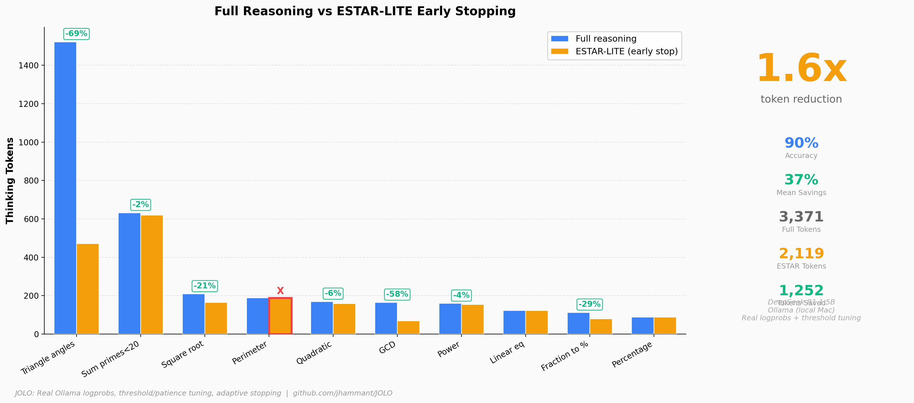

# JOLO — Jon Only Lives Once

**Stop your LLM from overthinking.**

JOLO implements [ESTAR-LITE](https://arxiv.org/abs/2502.10004) — a lightweight LightGBM classifier that watches an LLM's reasoning tokens in real-time and calls "stop" when the answer has already been reached. No retraining, no architecture changes. Just fewer wasted tokens.

[](https://opensource.org/licenses/MIT)
[](https://www.python.org/downloads/)

---

## The Problem

Reasoning models like DeepSeek-R1 think out loud. That's great — until they keep going long after they've found the answer:

```
<think>
  Step 1: A triangle has three interior angles...        ← useful
  Step 2: The angle sum property states they sum to 180° ← got it
  Step 3: Let me verify with a proof...                  ← unnecessary
  Step 4: Consider a Euclidean plane...                  ← still going
  Step 5: By the parallel postulate...                   ← please stop
  ...
  Step 12: Therefore, 180°. ✓                            ← 1,050 tokens wasted
</think>
```

That's real — the "triangle angles" problem in our test used **1,522 thinking tokens** when **472 were enough**.

## Results

Tested locally with DeepSeek-R1 1.5B via Ollama on a Mac:



| Metric | Value |
|--------|-------|
| Token reduction | **1.6x** |
| Accuracy | **90%** (9/10 correct) |
| Mean savings | **37%** |
| Best case | **69%** fewer tokens (Triangle angles) |

The pattern: problems where the model overthinks the most get the biggest savings. Easy problems that are already fast get left alone.

## How It Works

A small LightGBM classifier monitors four signal groups from the token stream at each generation step:

| Signal | What it watches |
|--------|----------------|
| **Instantaneous evidence** | Per-answer probability from token log-probs |
| **Cumulative stability** | Running evidence totals, how often the leading answer flips |
| **Early-stop curvature** | Is the evidence converging or still moving? |
| **Token confidence** | Mean/variance of log-probs, effective perplexity |

When the classifier is confident the answer has stabilized (threshold `τ=0.9`, sustained for 3 consecutive steps), it injects `</think>` and lets the model produce its final answer.

## Quick Start

### With Ollama (easiest)

```bash
# Install
pip install -e ".[ollama]"

# Pull a reasoning model
ollama pull deepseek-r1:1.5b

# Run the full test suite + generate graph
python scripts/test_and_graph.py
```

### With HuggingFace Transformers

```bash
pip install -e .
```

```python
from transformers import AutoModelForCausalLM, AutoTokenizer
from estar import EstarClassifier, EstarGenerator

model = AutoModelForCausalLM.from_pretrained(
    "deepseek-ai/DeepSeek-R1-Distill-Qwen-1.5B", device_map="auto"
)
tokenizer = AutoTokenizer.from_pretrained(
    "deepseek-ai/DeepSeek-R1-Distill-Qwen-1.5B"
)
classifier = EstarClassifier.load("models/estar_lite")

generator = EstarGenerator(
    model=model, tokenizer=tokenizer, classifier=classifier
)
result = generator.generate("Solve: 2x + 5 = 13")

print(f"Answer: {result.answer}")
print(f"Tokens: {result.thinking_tokens} (stopped_early={result.stopped_early})")
```

### Training Your Own Classifier

```bash
# 1. Generate training data (chains-of-thought sliced at 10-100%)
python scripts/generate_training_data.py \
    --model deepseek-ai/DeepSeek-R1-Distill-Qwen-1.5B \
    --dataset math500 \
    --output data/training_data.npz

# 2. Train
python scripts/train_classifier.py \
    --data data/training_data.npz \
    --output models/estar_lite
```

### Training Data Diversity

The classifier generalizes better when trained on diverse problem types. You can combine data from multiple sources.

**Custom datasets** use a simple JSON format:

```json
[
  {"question": "What is 2 + 2?", "answer": "4"},
  {"question": "Solve for x: 3x = 12", "answer": "4"}
]
```

Pass custom JSON to the training data generator:

```bash
python scripts/generate_training_data.py \
    --model deepseek-ai/DeepSeek-R1-Distill-Qwen-1.5B \
    --dataset custom \
    --custom-file my_problems.json \
    --output data/custom_data.npz
```

**Supported datasets:**

| Dataset | Flag | Source | Problem type |
|---------|------|--------|-------------|
| MATH-500 | `--dataset math500` | HuggingFaceH4/MATH-500 | Competition math |
| GSM8K | `--dataset gsm8k` | openai/gsm8k | Grade school math |
| Custom JSON | `--dataset custom --custom-file FILE` | Local file | Any |

**Adding a new dataset loader:** Add a branch to `load_dataset()` in `scripts/generate_training_data.py` that returns `list[dict]` with `"question"` and `"answer"` keys.

**Combining multiple `.npz` files** for diverse training:

```bash
# Generate data from different sources
python scripts/generate_training_data.py --dataset math500 --output data/math500.npz
python scripts/generate_training_data.py --dataset gsm8k --output data/gsm8k.npz

# Combine them
python -c "
import numpy as np
files = ['data/math500.npz', 'data/gsm8k.npz']
Xs, ys = [], []
for f in files:
    d = np.load(f)
    Xs.append(d['X']); ys.append(d['y'])
np.savez('data/combined.npz', X=np.vstack(Xs), y=np.concatenate(ys),
         feature_names=np.load(files[0])['feature_names'])
"

# Train on combined data
python scripts/train_classifier.py --data data/combined.npz --output models/estar_lite
```

### Tuning Threshold and Patience

The threshold (`tau`) and patience values are inference-time parameters — you train the model once, then sweep stopping criteria to find the best trade-off.

```bash
# From existing training data
python scripts/tune_threshold.py --data data/training_data.npz

# From test results (regenerates synthetic features)
python scripts/tune_threshold.py --results results/estar_summary.json

# Custom grid + save best config
python scripts/tune_threshold.py --data data/training_data.npz \
    --thresholds 0.5 0.7 0.8 0.9 0.95 \
    --patience-values 1 2 3 5 \
    --save-best --output models/tuned_config.json
```

The script prints a table of accuracy vs savings for each (threshold, patience) pair and highlights the best combination.

### Adaptive Patience

Fixed patience works well for uniform workloads, but you can scale patience with problem difficulty — longer sequences get more leeway before stopping.

**Formula:**

```
patience = max(2, min(5, tokens_so_far // 100))
```

Short problems (< 200 tokens) use `patience=2` for fast stopping. Long problems (500+ tokens) use `patience=5` to avoid premature cuts on complex reasoning.

**Subclass approach** — override `should_stop()` in the classifier:

```python
from estar.classifier import EstarClassifier

class AdaptiveEstarClassifier(EstarClassifier):
    def should_stop(self, features, tokens_so_far: int = 0) -> bool:
        self.patience = max(2, min(5, tokens_so_far // 100))
        return super().should_stop(features)
```

**Inline modification** — patch directly in `generate_online()`:

```python
# Inside the token-by-token loop, before classifier.should_stop():
classifier.patience = max(2, min(5, thinking_tokens // 100))
```

**When to use:**

| Scenario | Recommendation |
|----------|---------------|
| Uniform problem difficulty | Fixed patience (default `3`) |
| Mixed easy/hard problems | Adaptive patience |
| Latency-sensitive applications | Lower fixed patience (`1`-`2`) |
| Accuracy-critical applications | Higher fixed patience (`4`-`5`) or adaptive |

## Project Structure

```
├── estar/
│   ├── features.py           # Feature extraction (4 signal groups)
│   ├── classifier.py         # LightGBM wrapper with patience logic
│   ├── generator.py          # HuggingFace generation + early stopping
│   ├── ollama_generator.py   # Ollama backend (with real logprob support)
│   └── utils.py              # Answer extraction, normalization
├── scripts/
│   ├── test_and_graph.py     # End-to-end test with results graph
│   ├── make_linkedin_graph.py# Polished bar chart generator
│   ├── demo_ollama.py        # Quick Ollama demo
│   ├── generate_training_data.py
│   ├── train_classifier.py
│   ├── tune_threshold.py     # Threshold/patience grid sweep
│   └── benchmark.py
├── tests/
│   └── test_features.py
└── results/
    ├── estar_summary.json    # Raw test results
    └── estar_linkedin_graph.png
```

## Scope

This implements **ESTAR-LITE only** — the inference-time classifier. The full ESTAR system from the paper also includes:

- **ESTAR-FT** — fine-tuning models to emit `<stop>` tokens themselves
- **ESTAR-RL** — reinforcement learning with compute-aware rewards

Those require model training infrastructure and aren't included here.

## Paper

Based on [ESTAR: Early-Stopping Token-Aware Reasoning for Efficient Inference](https://arxiv.org/abs/2502.10004) by Wang, Yang, Zhang, Batra & Tillman (2025). This is an independent implementation, not affiliated with the original authors.

```bibtex
@article{wang2025estar,
  title   = {ESTAR: Early-Stopping Token-Aware Reasoning for Efficient Inference},
  author  = {Wang, Junda and Yang, Zhichao and Zhang, Dongxu and
             Batra, Sanjit Singh and Tillman, Robert E.},
  journal = {arXiv preprint arXiv:2502.10004},
  year    = {2025}
}
```

## License

MIT
